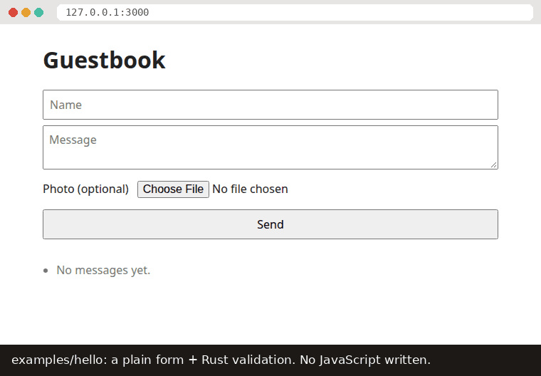

# Renox

**Laravel's productivity, Rust's performance, one binary to deploy.**

[](https://github.com/arif-rachim/renox/actions/workflows/ci.yml) [](#license) [](https://crates.io/crates/renox) [](https://docs.rs/renox) 

A web framework is a toolbox for building websites and web apps, so you don't start from zero.
Renox is one for Rust, and it is "batteries included": the pieces most apps need (pages,
forms, logins, a database, email, background jobs) come in the box and fit together.

Under the hood, Renox uses well-known parts. Axum is the web server library. HTMX and
Alpine.js are two small scripts that make pages update in the browser without a reload.
SQLite (or PostgreSQL) stores the data. You add one dependency, `renox`, and you get all of it.

**Read the docs at [renox.renoxium.com](https://renox.renoxium.com).** New here? Start with
[the tutorial](docs/tutorial.md): it builds one small app step by step and explains every word.
Already know Laravel? Read [coming from Laravel](docs/laravel.md); every guide is listed under
[Documentation](#documentation). API reference: [docs.rs/renox](https://docs.rs/renox).

## Why Renox

- **One binary to deploy.** A binary is a single program file. `rnx build` packs your pages
  (views), translations, CSS/JS and database changes (migrations) into that one file. Copy it
  and a `.env` settings file to a server, and you're done. You don't need Node, Redis or a
  separate program for background jobs. `rnx make:deploy` writes the Dockerfile, a systemd
  unit and Litestream backups for the SQLite file.
- **Laravel's workflow, in Rust.** Laravel is a popular PHP framework, loved for how quickly
  you can build with it. Renox follows its way of working. Generators (commands that write
  starter code for you), migrations, models and factories, validation, login and registration,
  policies, queues, a scheduler, mail, notifications, cache, file storage (local or S3/R2),
  translations and test helpers are all built in, and they all fit together.
- **HTMX-first.** The server builds each page as HTML. When someone types something wrong,
  the error shows up next to the field. Parts of a page (fragments) update in place, and you
  don't write any JavaScript for that. htmx and Alpine.js come bundled, and a
  Content-Security-Policy (a browser rule that blocks injected scripts) is on by default.



<sub>The [`examples/hello`](examples/hello) guestbook: Rust validation, errors inline, the list swapped in by htmx, and no page reloads.</sub>

## Quick start

You need Rust 1.94 or later ([rustup](https://rustup.rs) installs it) and a C compiler (for
SQLite; on Linux `build-essential` or your distribution's equivalent, on macOS
`xcode-select --install`).

```bash
cargo install renox-cli --version 1.0.0-rc.4   # installs `rnx`, Renox's command-line tool
rnx new blog && cd blog                        # or: --starter, --database postgres, --tailwind
rnx serve                                      # http://127.0.0.1:3000
```

`--version` is needed for now: 1.0 is still a release candidate (a test version before the
final one), and Cargo only installs one of those when you ask for it by number. For the
latest `main` instead: `cargo install --locked --git https://github.com/arif-rachim/renox
renox-cli`.

Then, in the app:

1. Open <http://127.0.0.1:3000>, register an account, and you are logged in. (Login and
   registration already work in a new app.)
2. Make a whole page with a form, a list, validation and tests:
   `rnx make:module posts --resource --fields "title:string body:text published:bool"`.
   `rnx serve` rebuilds and restarts by itself, and the browser reloads when a view changes.
3. Run the tests with `cargo test`, and see every command with `rnx --help` (Renox's own
   commands: `rnx help`).
4. Follow [the tutorial](docs/tutorial.md) for the rest:
   models, htmx forms, policies, a scheduled mail, tests and deploying.

The new app has a layout built with the UI kit, Renox's ready-made page parts (navigation bar,
account menu, toasts: small pop-up messages), a home
page, login and registration, an account page (profile, password, other devices), an error page
in the layout, its texts in `resources/lang/en.json`, a test in `tests/home.rs`, and an
`AGENTS.md` and a `CLAUDE.md` for coding agents. `rnx new blog --starter` writes the starter kit
on top: a sidebar layout with the notification bell, email verification, roles, a dashboard, a
users page for admins and the activity log, with their tests. With `--database postgres`,
create the `blog` and `blog_test` databases first (or edit `.env`).

> [!NOTE]
> The first build compiles every dependency and takes a few minutes. Later builds take
> seconds. See [docs/development.md](docs/development.md) for faster builds.

## Use Renox with Claude Code (or another coding agent)

A coding agent is an AI assistant that writes code in your project. Renox is made to be easy
for them: there is one way to do each thing, generators write the repetitive code
(boilerplate), and the docs' code examples are compiled in CI (the automatic checks on every
change), so they always match the real code.

**In an app made by `rnx new`, there is nothing to set up.** The app has an `AGENTS.md` (read by
Codex, Cursor, Copilot, Gemini CLI and others) and a `CLAUDE.md` that imports it (read by Claude
Code). They tell the agent which `rnx make:*` generators to use, where the cheat sheet, guides
and examples of *the Renox version the app uses* are, the app's layout, and the traps agents
have hit. Start the agent in the app's folder:

```bash
cd blog
claude      # or your agent of choice
```

and ask for what you want, for example:

> Add products with a name, a price and a photo: a list with search and pagination, a form
> that validates, only admins may edit. Use the generators, then write tests and run
> `cargo test`.

**In another project, or when the agent doesn't know Renox yet,** point it at the docs. Put
this in the project's `CLAUDE.md` (or `AGENTS.md`):

```markdown
This app uses Renox, a Laravel-like Rust web framework (https://github.com/arif-rachim/renox).
Before writing Renox code, read
https://raw.githubusercontent.com/arif-rachim/renox/main/llms.txt: it maps every topic to the
guide or example that shows the official way (its links are paths in that repository).
Prefer `rnx make:*` generators, `use renox::prelude::*`, and the UI kit (`renox/ui.html`) for
pages. Run `cargo test` after changes.
```

**Claude Code, set up once per app** (optional, both make it faster):

1. Give it Renox's docs and examples on disk, at the version your app uses, so it reads them
   instead of fetching or guessing:

   ```bash
   git clone --depth 1 --branch v1.0.0-rc.4 https://github.com/arif-rachim/renox ~/src/renox
   claude --add-dir ~/src/renox     # or, inside a session: /add-dir ~/src/renox
   ```

2. Let it build, test and run the generators without asking each time, in the app's
   `.claude/settings.json` (commit it, so the whole team gets it):

   ```json
   {
     "permissions": {
       "allow": [
         "Bash(cargo build:*)",
         "Bash(cargo check:*)",
         "Bash(cargo clippy:*)",
         "Bash(cargo test:*)",
         "Bash(cargo fmt:*)",
         "Bash(rnx make:module:*)",
         "Bash(rnx make:model:*)",
         "Bash(rnx make:migration:*)",
         "Bash(rnx migrate)",
         "Bash(rnx migrate:status)"
       ]
     }
   }
   ```

   `name:*` allows every command that starts with `name`, so `rnx migrate` is listed exactly:
   commands that drop data or reach the outside world (`rnx migrate:fresh`, `rnx db:seed`,
   deploys) are better left to ask.

Tips:
- [llms.txt](llms.txt) and the [cheat sheet](CHEATSHEET.md) are the cheapest way in:
  short, and every Rust example in them compiles.
- Renox's source is on disk after the first build (`~/.cargo/registry/src/*/renox-core-*/`), so
  an agent can read the real code instead of guessing.
- Ask for tests with every change: `renox::testing::TestApp` drives the app without a server,
  so `cargo test` checks pages, forms, mail and jobs in seconds.

## A taste

Here is a small guestbook. A form is checked (validated) in Rust, a new row is saved in the
database, and only the updated list is sent back, so htmx swaps it into the page without a
reload:

```rust
use renox::prelude::*;
use serde::{Deserialize, Serialize};

#[derive(Model, Serialize, Default)]
#[model(table = "entries")]
struct Entry { id: i64, name: String, message: String }

#[derive(Deserialize)]
struct EntryForm { name: String, message: String }

impl Validate for EntryForm {
    fn rules(&self, v: &mut Validator) {
        v.field("name", &self.name).required().max(50);
        v.field("message", &self.message).required().between(3, 280);
    }
}

// Bad input never gets here: htmx gets a 422 and the errors appear next to the fields.
async fn store(State(db): State<Db>, Valid(form): Valid<EntryForm>) -> Result<View> {
    // Save the new entry as a row in the `entries` table.
    Entry::create(&db, Entry { name: form.name, message: form.message, ..Default::default() }).await?;
    // Read every entry back, newest first.
    let entries = Entry::query().latest().get(&db).await?;
    // Render only the template's `entries` block; htmx puts it into the page.
    Ok(view("guestbook.html", context! { entries }).fragment("entries"))
}

// Routes live in modules, registered with `App::new().module(Guestbook)`.
struct Guestbook;

impl Module for Guestbook {
    fn name(&self) -> &'static str { "guestbook" }
    fn routes(&self) -> Routes {
        Routes::new().post("/entries", store).name("entries.store")
    }
}
```

```html
<form hx-post="/entries" hx-target="#entries" hx-swap="outerHTML">  <!-- CSRF sent for you -->
  <input name="name"> <textarea name="message"></textarea> <button>Send</button>
</form>
                                                  {# all htmx gets back #}
<ul id="entries"><li>{{ e.name }}: {{ e.message }}</li></ul>

```

## Feature tour

Everything below is built in. Click a heading to open it. Words in `code` are the names you
type in Rust, templates or the terminal.

<details>
<summary><b>Web</b>: routes, sessions, CSRF, security headers</summary>

- Routes (rules like "when someone opens `/products`, run this function") are grouped in
  modules and in prefixed groups (`Routes::group("/admin", "admin.", …)`), with names
  (`route('products.edit', id)` in templates), guards that decide who may open them
  (`.require_auth()`, `.guest_only()`, `.require_verified()`, `.require_gate("admin")`,
  `.require_role(…)`, `.require_permission(…)`, `.require_ability(…)` for API tokens,
  `.require_password_confirmed()`) and rate limits that cap how often someone may call them
  (`.throttle(60, Duration::from_secs(60))`, or a named limiter that picks the limit per user or
  API key: `.throttle_by("api")`).
- Routes for other hosts (`Routes::domain("{account}.example.com", …)`), a fallback for what
  nothing else answers, redirects by route name (`Redirect::route`, `Redirect::intended`), and
  the current route in views (`route_is('admin.*')`) and handlers (`CurrentRoute`).
- Route model binding: `Found(post): Found<Post>` loads the row `{post}`, `{id}` or `{slug}`
  names (404 if there's none, within the tenant's default scope). Pages without a handler
  (`.view("/about", "about.html")`, `.redirect(…)`), and `.etag()` for 304s on feeds and lists.
- Sessions (what the app remembers about a visitor between pages) live in an encrypted cookie
  (or the database with `SESSION_DRIVER=database`). Flash messages (shown once, on the next
  page), old input (what the visitor typed, kept after an error) and list/counter helpers
  (`session.push`, `session.increment`) come built in. CSRF protection, which stops other sites
  from sending forms in your visitors' name, is automatic for forms and htmx.
- `_method` spoofing lets plain HTML forms, which can only send GET and POST, send PUT and
  DELETE.
- Security headers and a Content-Security-Policy are on by default, CORS can be enabled per
  route, `TRUSTED_HOSTS` refuses other hosts, and `App::xsrf_cookie()` hands the CSRF token to
  JavaScript clients as Laravel's `XSRF-TOKEN` cookie.
- Webhooks (messages another service sends to your app, like "this order was paid") from
  payment gateways and other services (`impl Webhook`, `.webhook::<W>(path)`):
  signature checks (HMAC, Stripe-style), each event stored and processed once in the queue,
  with `webhook:retry` when something failed.
- Maintenance mode (`my-app down --secret …`) and `/health` are included.
- Plain and encrypted cookies (`Cookies`, `SetCookie`), downloads and streamed responses
  (`Download`), and `abort(StatusCode::GONE, "…")` for any status with a message.
- Your own middleware, code that runs around every request (`App::layer`,
  `Routes::route_layer`), shared services (`App::provide`), template filters (`App::templates`),
  data for every view (`App::share`) and async gates.
</details>

<details>
<summary><b>Views & HTMX</b>: MiniJinja templates, fragments, Alpine.js</summary>

- Templates are HTML files with blanks the app fills in. Renox uses MiniJinja for them, with
  layouts, blocks and macros. While you develop, templates reload when you refresh the page.
- `.fragment("block")` answers htmx with just one block of the page, not the whole page.
  `HxTrigger`, `HxRedirect` and `Back` cover the rest.
- `{{ csrf_field() }}`, `{{ method_field('PUT') }}`, `old()`, `error()`, `t()` and `route()` work
  in every template (`route('products.index', q=q)` adds a query string), `can('update', product)` on models the handler wrapped with `Can::new`, and
  `pagination(products)` once imported from `renox/pagination.html`.
- `asset('app.css')` adds a content hash (`?v=…`) that changes when the file changes, so
  browsers can keep (cache) assets for a year and still get new versions.
- Stacks: a page or component pushes a script or a `<meta>` into the layout's
  `{{ stack('scripts') }}` / `{{ stack('head') }}`, once if asked (``).
- Tailwind CSS without Node: `rnx new --tailwind`, and `rnx serve` / `rnx build` run Tailwind's
  standalone CLI (downloaded once, checked by SHA-256).
- Components are macros that see the request (`old`, `error`, `t`, `can`, `auth`), and a UI kit
  ships with Renox (`renox/ui.html`), with a warm default theme (Inter and Poppins bundled, a
  type scale that puts the important figure first; a `classic` theme too):
  - form fields, buttons, cards, alerts, sheets, menus, tabs and tables, with dark mode;
  - the page's frame: a navigation bar or a back office's sidebar, page headers, toolbars,
    row actions, lists, card grids and progress bars;
  - actions as Filament has them: a form in a sheet or slide-over sent with htmx (errors
    stay in the sheet, a success closes it with a toast), icon buttons with tooltips,
    counts on buttons, disabled buttons that say why, and keyboard shortcuts (⌘S);
  - the fields Filament has: radio groups, checkbox lists, toggle buttons, tags, a
    searchable select (its options can come from the server as you type, and new ones
    can be added and renamed in place), file drops, a date picker, key-value pairs, repeaters and wizards,
    fields shown only when another has a value, and nested form names
    (`lines[0][qty]`) read into a `Vec` of structs;
  - infolists for a record's page: labels and values formatted as money (`APP_CURRENCY`),
    dates, "3 hours ago", badges, Yes/No, swatches, pairs or Markdown;
  - keyboard support and WCAG AA contrast;
  - toasts (`Toast::success(…)`, with a body, links, a duration and a position) and live
    validation.
- Dashboards without a chart library (`renox::chart`): figures with their change and a
  sparkline, line, area, bar, pie and doughnut charts drawn on the server as HTML and SVG
  (crosshair tooltips, keyboard, a data table, colours checked for colour blindness), values
  per day or month from a query (`Trend::of(query, "created_at").over(period).sum(…)`), a
  period filter, and widgets that load on their own and refresh.
- A data grid for dashboards (`renox::grid`): filters per column by kind (a date range
  calendar for dates), server pages and sorting in the URL, grouped headings, frozen columns,
  different columns on phones and desktops kept per user, and cells drawn by the page
  (`{{ sparkline(…) }}` charts, buttons); columns moved and resized by dragging, details with audit fields, editing in place, rows
  dragged into order, merged cells, and CSV/Excel/print exports. Also a search box, filter
  chips, rows that link to a page, several grids on one page, bulk and row actions, summaries
  and groups, cards on phones, image/badge/link/copyable cells, columns from related tables,
  an advanced filter, state remembered in the session and polling ([guide](docs/grid.md)).
- `.also("block")` sends out-of-band blocks with a fragment; `HxRetarget`, `HxReswap` and
  `HxPushUrl` set the other htmx headers.
</details>

<details>
<summary><b>Database</b>: SQLite or PostgreSQL, migrations, models</summary>

- Every form field type maps to a Rust type and a column on both databases: checkboxes, selects
  (`#[derive(DbEnum)]`), multi-selects (`Json<Vec<_>>`), dates, times, JSON, UUIDs
  ([docs/types.md](docs/types.md)).
- Migrations (small files that create or change tables) are plain SQL and run in batches
  (`migrate`, `migrate:rollback`, `migrate:fresh --seed`), with per-database files when SQL
  differs.
- A model is a Rust struct that matches a table: one struct is one row. `#[derive(Model)]`
  gives it `create`, `save`, `delete` (with optional soft deletes), `find_or_404`,
  a query builder (OR groups, sub-queries, `where_has`, aggregates, `group_by`/`having`, raw
  fragments, row locks, bulk updates, upserts, `update_or_create`, chunks), pagination (numbered,
  simple or by cursor) and factories with fake data. The key is the `id` field's type: a
  number the database counts, or a ULID, UUID or string (`rnx make:model Invoice --key ulid`).
- Models can save only what changed (`save_changes`, `save_only`), run hooks (`saving`, `saved`,
  `deleting`, `deleted`), carry a default scope, e.g. the current tenant, that every query
  applies until `unscoped()`, and keep secrets encrypted at rest (`Encrypted<String>` fields,
  sealed with `APP_KEY`). Transactions nest with savepoints (`tx.savepoint(…)`).
- Relations (links between tables, like a post and its comments) are explicit and N+1-free, so a
  list never runs one extra query per row: `belongs_to`, `has_many`, many-to-many pivots (with
  pivot columns) and polymorphic `Morph` load a page's related rows in one query each, and
  `count_many` / `sum_many` give counts and sums per row ([guide](docs/relations.md)); joins
  read into `#[derive(FromRow)]` structs with `fetch_as`.
- For anything else there's raw SQL with `?` placeholders, and transactions that can retry on a
  busy database (`db.transaction_retrying(3, …)`): `renox::db::sql("…").bind(x).fetch_all(&db)`.
- SQLite is the default. PostgreSQL is one feature flag away, with the same code
  ([guide](docs/postgresql.md)).
</details>

<details>
<summary><b>Validation, auth & authorization</b></summary>

- Validation checks what people send before your code uses it. `Valid<T>` validates forms,
  JSON bodies and query strings with rules such as `required`,
  `required_if`, `email`, `between`, `matches` (regex), `digits`, dates (`before`, `after`),
  `unique`, `exists`, `same`, `gt`/`lt` against another field, `decimal`, `alpha_dash`, `uuid`,
  `json`, `timezone`, `size`, `image`, `mimes`, `dimensions` (pixels) and `current_password`, per item of
  a list (`each`, `nested`, `distinct`), and your own reusable `Rule`s. Messages come in English,
  or from your own translations (`resources/lang/<locale>.json`). Simple forms declare them as attributes:
  `#[derive(Validate)]` with `#[validate(required, email, unique("users", "email"))]`.
- Form requests: `prepare` tidies the input, `authorize` answers 403 before any rule, and
  `after` runs checks that need the database, with errors shown like a rule's.
- `Auth::new()` adds login, registration, logout, remember me, password reset and email
  verification, with Argon2id password hashing (passwords are stored scrambled, never as typed)
  and login throttling, on pages built with the UI kit;
  `.account()` adds a profile page
  (email change with re-verification, password, "log out other devices", delete account).
  Logout ends only this device. Password rules come from `Password::min(12).mixed_case()…`
  (`.uncompromised()` refuses passwords from known breaches, asking Have I Been Pwned by hash
  prefix), and
  users imported from Laravel log in with their bcrypt hashes.
- Auth events (`LoggedIn`, `LoginFailed`, `Registered`, …) and an opt-in `Audit` module that
  records them, plus your own entries (`audit::record`).
- API tokens (`Authorization: Bearer`) with abilities and expiry serve mobile apps and
  integrations.
- Policies and gates, the rules for who may do what: `user.authorize("update", &product)?` in
  handlers, `can(...)` in views, `App::gate_before` for super-admins, and an opt-in
  `Permissions` module with roles and permissions (`user.assign_role(db, "editor")`,
  `.require_role("editor")`).
</details>

<details>
<summary><b>Background work</b>: queue, scheduler, events, mail, notifications</summary>

- The job queue holds work to do in the background (like sending a mail), so pages answer
  fast. It lives in your own database, with retries, backoff and `queue:failed` / `queue:retry`.
  On PostgreSQL, workers on several servers never take the same job. Queues drain in priority
  order (`--queue high,default`); jobs can be unique, encrypted, rate limited or kept from
  overlapping, have a `failed` hook, and run in chains or in batches with progress.
- The scheduler runs tasks at set times (`every_minutes(5, …)`, `daily_at("02:00", …)`,
  `cron("30 9 * * 1-5", …)`, `weekly_on`, `monthly_on`, with `weekdays()`, `between(…)`,
  `on_failure(…)`). It runs inside `serve` in `APP_TIMEZONE` or a task's own IANA zone, daylight
  saving included, and each run is claimed once when several servers share the database.
- Events and listeners are included: one part of the app announces "this happened", and
  other parts react.
- Mail comes from templates, with a text version, several recipients, cc/bcc, reply-to and
  attachments, SMTP in production and a preview page at `/_renox/mail` while developing. More
  mailers by name (`App::mailer`), and `MAIL_FAILOVER` to a second provider when the first
  is down.
- Notifications go by mail, to the database and through your own channels (WhatsApp, SMS…), now
  or through the queue, to users or to plain addresses, each in the recipient's language, with
  channels chosen per recipient. Mail views have `t()` and components (button, panel, table).
  `Auth::new().notifications()` adds a bell for the navigation bar: unread badge, a panel to
  read, mark and delete them, and new ones arriving live over Server-Sent Events.
- A queue dashboard at `/_renox/queue` (behind a gate) shows waiting jobs, throughput, failed
  jobs to retry or forget, and batch progress.
- `state.http` calls other services with timeouts and retries; in tests, `app.fake_http()`
  answers instead and no request reaches the network. Scheduled tasks can ping health checks.
</details>

<details>
<summary><b>Files, cache, translations</b></summary>

- Uploads are ordinary form fields, checked by their content. They're stored locally or on S3/R2,
  with signed temporary URLs; `storage.list`, `copy` and `rename` work on both. More disks,
  each with a name (`App::disk("backups", …)`, `state.disk_named("backups")`), sit next to the default.
- The cache keeps results you don't want to work out again (`remember`, `put`, `forget`, `add`,
  `pull`, `increment`). It lives in memory or in the database, with atomic locks
  (`state.cache.lock("stock:42", ttl)`) that hold across servers on the database store.
- Each visitor gets their own locale, the language the app speaks to them (chosen, or their
  browser's with `App::detect_locale()`), from `resources/lang/*.json`, with `t()`, plurals and
  Laravel's plural ranges. Renox's own texts are English; the same files translate them (`ui.*`,
  `renox.auth.*`, `renox.validation.*`).
</details>

<details>
<summary><b>SEO & analytics</b>: meta tags, sitemaps, Search Console, GA4, Tag Manager</summary>

- `{{ seo(title=…, description=…, image=…) }}` writes the title, description, canonical URL,
  OpenGraph and Twitter card tags.
- `robots.txt` is generated for you, and `Sitemap` builds `sitemap.xml` from routes and models.
  Staging servers say `noindex`. `/favicon.ico` answers a quiet 204 until you add one.
- Search Console verification, GA4 and Tag Manager come from `.env`, CSP-ready with nonces, and
  only in production.
- `analytics::event(&session, "sign_up", …)` reaches `gtag` with the htmx swap, the page or the
  next page. `ServerEvent` sends from the server through the Measurement Protocol, where ad
  blockers can't drop it.
</details>

<details>
<summary><b>Testing & tooling</b></summary>

```rust
use renox::prelude::*;
use renox::testing::TestApp;

#[renox::test]
async fn login_page_and_registration_errors() {
    let app = TestApp::new(App::new().module(Auth::new())).await; // fresh DB, fake mail and queue
    app.get("/login").await.assert_ok().assert_see("Log in");
    app.htmx().post("/register", &[("email", "nope")]).await.assert_invalid("email");
}
```

```bash
rnx make:module products --resource --fields "name:string price:money"  # a whole CRUD with tests
                                                  # also make:model -m, make:policy, make:job, make:factory, make:test…
rnx make:command orders:close                     # a typed command (clap): --help, checked arguments, prompts
rnx route:list                                    # every route with its name, module and guards
rnx db:shell                                      # SQL prompt, no sqlite3/psql needed
rnx build && rnx make:deploy                      # dist/blog + Dockerfile, systemd (+ socket), Litestream
```

`rnx make:deploy` also writes a systemd socket unit: deploys then restart the app without
refusing a single connection.

In production, timeouts keep a slow database or mail server from holding requests, `/health`
feeds your load balancer, and panics in handlers, jobs and tasks are contained. CI checks this by
stopping, pausing and locking the database under a running app
([running in production](docs/operations.md)). Tests are covered in [docs/testing.md](docs/testing.md).

Every request gets an id that's in its log lines and its `X-Request-Id`. Logs can be JSON
(`LOG_FORMAT=json`) or go to a file. `App::report` hands 500s, failed jobs and failed tasks to
Sentry or a chat channel. Error pages use the app's layout. While developing,
`/_renox/debug` shows the last requests with their SQL, and flags N+1 queries.
</details>

<details>
<summary><b>Made for coding agents</b></summary>

- [CHEATSHEET.md](CHEATSHEET.md) has every common pattern in a few lines, and it's compiled in CI,
  so it can't go stale.
- [llms.txt](llms.txt) maps each topic to the one example file that shows it.
- Apps made by `rnx new` include an `AGENTS.md` (and a `CLAUDE.md` importing it) that tells an
  assistant how the project works; see [Use Renox with Claude Code](#use-renox-with-claude-code-or-another-coding-agent).
</details>

## How it compares

|  | **Renox** | **Loco** | **Axum on its own** |
|---|---|---|---|
| Inspired by | Laravel | Rails | (a library, not a framework) |
| Front end | Server-rendered + htmx + Alpine, bundled, no Node | Server-side templates, or a client-side app built with npm | Up to you |
| Data | Its own light model layer on sqlx; SQLite first, PostgreSQL optional | SeaORM entities | Up to you |
| Jobs | Queue in your database (SQLite or PostgreSQL), run inside the same binary | Queue in Redis, PostgreSQL or SQLite, or in-process tasks | Up to you |
| Auth, mail, uploads, i18n | Built in, with pages and translations | Mailers and storage built in; auth comes with the SaaS starter | Assemble from crates |
| Deploy | One binary with its assets + `.env`; Dockerfile, systemd, Litestream generated | Binary + config; Dockerfile, nginx or AWS Lambda generated | Up to you |
| Maturity | 1.0 release candidates on crates.io, one maintainer | Released on crates.io, larger community | Mature, widely used |

Choose **Loco** if you prefer Rails conventions, SeaORM or a JavaScript front end. Choose
**Axum on its own** if you want to assemble every piece yourself. Choose **Renox** if you want
Laravel's everything-included workflow and HTML over the wire, deployed as a single file.

## Examples

Every example is built with the UI kit, so they also show what a Renox app looks like
out of the box.

- [`examples/shop`](examples/shop): a whole online shop: htmx search, a cart, checkout in one
  transaction that never oversells, queued mail and notifications, an admin for the `admin` role
  with photo uploads and an audit trail, a typed `shop:make-admin` command that asks for what's
  missing, English and Spanish texts, and its deploy files (with the systemd socket). Start here.
- [`examples/htmx-recipes`](examples/htmx-recipes): a modal form, inline edit, infinite scroll,
  delete in place, tabs and a dropdown, with htmx, Alpine and fragment-returning handlers.
- [`examples/relations`](examples/relations): a public blog on Tailwind (Markdown posts, `seo()`
  tags, an RSS feed, a sitemap and search) over belongs-to, has-many and many-to-many (a pivot
  with its own columns and `sync`), polymorphic likes, loaded without N+1 with counts per post,
  a category's latest comments through its posts (`has_many_through`), and reports with
  `group_by` and SQL joins.
- [`examples/teams`](examples/teams): a multi-tenant SaaS: teams and members, a default scope
  that keeps each team's projects apart, a super-admin, an encrypted team secret, and a form
  request (`prepare`, `authorize`, `after`) for adding members.
- [`examples/grid`](examples/grid): a sales dashboard on one data grid, on a phone and a desktop,
  and a follow-up page with two grids.
- [`examples/backoffice`](examples/backoffice): the back office of a small business: invoices
  issued from a stock ledger and printed, Midtrans/Xendit payment pages and their webhooks, a
  CSV import, exports made in the background, staff roles, the activity log and settings.
- [`examples/crud`](examples/crud): one resource end to end on the UI kit, with pagination, live
  validation, toasts, owner-only edit and delete through a policy (behind a confirmation sheet),
  soft deletes with a trash, model hooks, an error page in the layout, and tests.
- [`examples/api`](examples/api): a JSON API for a mobile app, with tokens that carry abilities
  and expire, Bearer auth, cursor pagination, JSON validation errors, CORS and a named rate
  limiter (per user, per IP for guests), plus a small browser client that calls it.
- [`examples/jobs`](examples/jobs): an event, a queued receipt mail (with reply-to), admin
  notifications, a statement mailed with a CSV attachment and a bcc, daily and weekly reports
  scheduled in a time zone, and the queue's chains, batches with a progress bar, unique and
  encrypted jobs.
- [`examples/uploads`](examples/uploads): public photos checked by content, and private invoices
  behind expiring links, on the local disk or S3 (tested against a real S3 server in CI).
- [`examples/fields`](examples/fields): every form input type saved and shown back, on SQLite
  and PostgreSQL ([docs/types.md](docs/types.md)).
- [`examples/postgres`](examples/postgres): one app, tested on PostgreSQL and SQLite.
- [`examples/webhooks`](examples/webhooks): Midtrans, Xendit and Stripe webhooks marking orders
  paid, each tested with good, forged and repeated calls.
- [`examples/hello`](examples/hello): the guestbook from the GIF, with an HTMX form, a photo upload,
  an event that queues mail, a scheduled task, English and Spanish texts, login and an account page.

## Coming from Laravel

| Laravel | Renox |
|---|---|
| `php artisan` | `rnx` (`rnx make:model`, `rnx migrate`, `rnx route:list`, …) |
| `Route::resource`, `make:controller --resource` | `Routes::resource`, `rnx make:module --resource` |
| `Event::fake`, `Notification::fake`, `$this->travel()` | `app.fake_events()`, `app.fake_notifications()`, `app.travel(…)` |
| Blade | MiniJinja templates, with `` and `` |
| Blade components, Breeze's UI | Macros that see the request (`rnx make:component`), the `renox/ui.html` kit |
| `routes/web.php`, `Route::prefix()->name()->group()` | `Module::routes`, `Routes::group("/admin", "admin.", …)` |
| `Route::domain`, `Route::fallback`, `redirect()->route()`, `->intended()` | `Routes::domain(…)`, `Routes::fallback(…)`, `Redirect::route(…)`, `Redirect::intended(…)` |
| `HasUlids` / `HasUuids`, `encrypted` casts, nested transactions | `id: Ulid` / `id: Uuid`, `Encrypted<T>` fields, `tx.savepoint(…)` |
| `routeIs`, `@class`, `trans_choice` ranges | `route_is('admin.*')`, `class_names(…)`, `{0} none\|[1,*] :count` in lang files |
| Factory states and sequences | `Product::factory().count(3).state(f).sequence(\|i, p\| …)` |
| Route model binding, `Route::view`, `Route::redirect` | `Found<Post>`, `.view(…)`, `.redirect(…)` |
| Several disks (`Storage::disk('s3')`) | `App::disk(name, …)`, `state.disk_named(name)` |
| Several mailers, the `failover` transport | `App::mailer(name, …)`, `state.mailer_named(name)`, `MAIL_FAILOVER` |
| `hasManyThrough`, named error bags | `relations::has_many_through`, `#[validate(bag = "login")]` |
| Middleware | `.require_auth()`, `.throttle(…)`, `Routes::route_layer`, `App::layer` |
| `RateLimiter::for('api', …)` | `App::rate_limiter("api", …)` and `.throttle_by("api")` |
| Exception reporting (`report()`), Telescope/Debugbar | `App::report(…)`, `/_renox/debug` |
| Eloquent | `#[derive(Model)]` and the query builder; relations are explicit loaders ([docs/relations.md](docs/relations.md)) |
| Form Requests (`authorize`, `prepareForValidation`, `after`) | `Valid<T>` with `impl Validate` (`authorize`, `prepare`, `after`), or `#[derive(Validate)]` for the rules |
| Gates and policies | `App::gate`, `impl Policy`, `user.authorize(…)`, `.require_gate(…)` |
| spatie/laravel-permission | the `Permissions` module: `assign_role`, `has_permission`, `.require_role(…)` |
| Global scopes (tenancy) | `#[model(default_scope = "…")]` with `renox::context` |
| Breeze / Jetstream | `rnx new --starter`: email verification, roles, a dashboard, the users page and the activity log; or `Auth::new().account()` alone |
| Sanctum | API tokens with abilities (`create_token_with`, `.require_ability(…)`) |
| `Cache::lock` | `state.cache.lock(name, ttl)` |
| Queues, mail, notifications, scheduler | `impl Job`, `mail_view`, `impl Notification`, `app.schedule()` |
| Horizon | the queue dashboard: `.module(renox::queue::Dashboard)` |
| `Http::` facade, `Http::fake()` | `state.http`, `app.fake_http()` |
| `View::share` | `App::share` |
| Tinker | `rnx db:shell` and your own commands (`App::command`) |
| Artisan commands (`$signature`, `$this->ask()`, `confirm()`, `secret()`, `choice()`) | `impl AppCommand` on a clap struct, `renox::prompt::{ask, confirm, secret, choice}` |
| `@push` / `@stack` | `…` / `{{ stack('scripts') }}` |
| Vite + Tailwind | `rnx new --tailwind` (the standalone CLI, no Node) |
| Livewire | htmx and Alpine.js, with handlers that return fragments |
| Filament tables | `renox::grid` with `renox/grid.html` ([docs/grid.md](docs/grid.md)) |
| Filament forms, infolists, actions, notifications, widgets | the kit's fields, `infolist`, `action_sheet`, `Toast` and `notification_bell`, `stat`/`chart(…)` with `renox::chart` ([docs/ui.md](docs/ui.md)) |
| Filament's demo app | [`examples/backoffice`](examples/backoffice) |

Not planned: runtime-reflected Eloquent-style models, Redis, and a REPL.

## Documentation

The files below are also a documentation site with search, built with Renox itself
([`site/`](site)): **[renox.renoxium.com](https://renox.renoxium.com)**, rebuilt whenever they
change on `main`.

- [The tutorial](docs/tutorial.md): build one app from `rnx new` to a server, step by step.
- [Coming from Laravel](docs/laravel.md): each Laravel concept and its Renox counterpart.
- [CHEATSHEET.md](CHEATSHEET.md): one short, compiled example per task.
- Guides: [routing and middleware](docs/routing.md), [validation](docs/validation.md),
  [views and the UI kit](docs/ui.md), [the data grid](docs/grid.md), [mail and notifications](docs/mail.md),
  [scheduler, events, cache and commands](docs/scheduling.md), [testing](docs/testing.md),
  [relations](docs/relations.md), [authorization and tenants](docs/authorization.md),
  [the queue](docs/queue.md), [field types](docs/types.md),
  [PostgreSQL](docs/postgresql.md), [production](docs/operations.md),
  [faster builds](docs/development.md), [stability and versions](docs/stability.md).
- [llms.txt](llms.txt): a map of the docs and examples for coding agents.
- The API reference: [docs.rs/renox](https://docs.rs/renox).
- [ROADMAP.md](ROADMAP.md) and [CHANGELOG.md](CHANGELOG.md).

## Status

Renox **1.0.0-rc.4**, the release candidate for 1.0, is on crates.io (`renox`,
`renox-core`, `renox-macros`, `renox-cli`). If nothing turns up, the same code becomes 1.0.0,
and from there Renox follows semver ([docs/stability.md](docs/stability.md)). The [Laravel parity review](docs/audit/2026-10-laravel-parity.md)
compares it with Laravel and Filament feature by feature, as of October 2026. Since the first
review (after M17), milestones M18–M32 closed its gaps:

- **M18–M21:** tenancy, roles and permissions, account pages; the query builder and model
  hooks; cron schedules in real time zones, locks, a fuller queue, an HTTP client, a queue
  dashboard, localized mail; the UI kit, scaffolding, test tools, error reports and logs,
  Tailwind, typed commands, form requests, database sessions, deploys without refused
  connections.
- **M22–M26:** ULID/UUID/string keys, savepoints, encrypted fields, domain and fallback routes,
  `route_is`, factory states, plural ranges, `#[derive(Validate)]`, the browser's language,
  and a completeness pass (docs for every public item, CLI tests).
- **M27–M28:** the data grid, then search, actions, summaries, groups, cards on phones,
  related columns and an advanced filter.
- **After M28:** Filament's forms, infolists, notifications, dashboard widgets and actions in
  the UI kit.
- **M29–M32:** fourteen examples, among them a full back office; every example on the kit,
  with its navigation and page frame; a warm default theme with a type scale; and an
  English-only codebase.
- **M33:** small additions the review still listed: 28 more validation rules
  (`gt`/`lt`, `decimal`, `dimensions`, `json`, …), route model binding (`Found`), named
  disks, ETags, the `XSRF-TOKEN` cookie, trusted hosts, and view and redirect routes.
- **M34:** the rest of the review's small additions: `current_password`, the breach check,
  session `keep`/`flash_now`, named error bags, several mailers with failover, `has_many_through`.

Then v1.0: the API audit and its fixes, semver checks in CI, the documentation site with the
tutorial and the Laravel guide, the starter kit (`rnx new --starter`) and the 1.x promise.
Breaking changes up to the release candidate are listed in [CHANGELOG.md](CHANGELOG.md).

An app made by `rnx` from crates.io depends on that release (`renox = { version = "…" }`); to
upgrade, raise the version and read the changelog. An `rnx` installed from Git pins its apps
to the commit it was built from (`renox = { git = …, rev = "…" }`) instead.

Every change is tested in CI on Linux, macOS and Windows, on SQLite and PostgreSQL, against a
real S3 server, with a chaos test, the minimum Rust version, every Cargo feature on its own, and
a new app made with every generator and built into a Docker image. Optional Cargo features:
`postgres`, `s3`, `uuid`, `xlsx` (and `fake`, `http`, `server-events`, on by default).

Issues and feedback are welcome: see [CONTRIBUTING.md](CONTRIBUTING.md), and
[SECURITY.md](SECURITY.md) to report a vulnerability.

## License

Licensed under either of

- Apache License, Version 2.0 ([LICENSE-APACHE](LICENSE-APACHE))
- MIT license ([LICENSE-MIT](LICENSE-MIT))

at your option.
